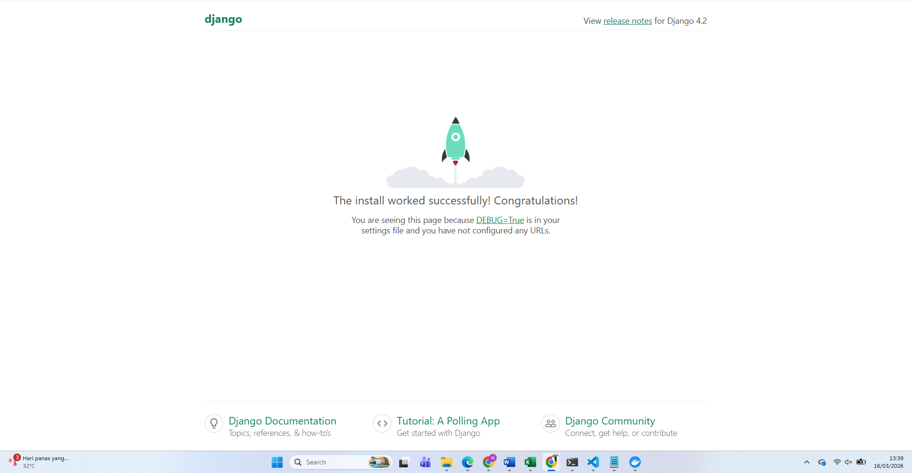

# 🎓 Simple LMS – Django Docker Setup

## 📌 Deskripsi Project

Project ini merupakan setup **Django Web Application menggunakan Docker dan PostgreSQL** sebagai database untuk sistem **Simple Learning Management System (LMS)**.

Project ini dibuat untuk memenuhi tugas **Setup Development Environment menggunakan Docker**.

---

# 🐳 Teknologi yang Digunakan

* Python 3.11
* Django 4.2
* Docker
* Docker Compose
* PostgreSQL

---

# 📂 Struktur Project

```
simple-lms/
│
├── docker-compose.yml
├── Dockerfile
├── requirements.txt
├── manage.py
│
├── config/
│   ├── settings.py
│   ├── urls.py
│   └── wsgi.py
│
├── Screenshots/
│   └── django.png
│
├── .env.example
└── README.md
```

---

# ⚙️ Environment Variables

File `.env` digunakan untuk konfigurasi database.

Contoh isi `.env`:

```
DB_NAME=lms_db
DB_USER=lms_user
DB_PASSWORD=lms_password
DB_HOST=db
DB_PORT=5432
```

---

# 🚀 Cara Menjalankan Project

## 1️⃣ Clone Repository

```
git clone https://github.com/USERNAME/simple-lms.git
```

Masuk ke folder project

```
cd simple-lms
```

---

## 2️⃣ Build Docker Container

```
docker compose build
```

---

## 3️⃣ Jalankan Container

```
docker compose up
```

---

## 4️⃣ Akses Aplikasi

Buka browser dan akses:

```
http://localhost:8000
```

Jika berhasil akan muncul **Django Welcome Page**.

---

# 🗄 Database

Project ini menggunakan **PostgreSQL yang dijalankan melalui Docker container**.

Service database dikonfigurasi di file:

```
docker-compose.yml
```

---

# 📸 Screenshot

## Django Welcome Page



---

# 📚 Referensi

* Docker Documentation
* Django Documentation
* PostgreSQL Documentation

---

# 👨‍💻 Author

**Daffa Tri**
